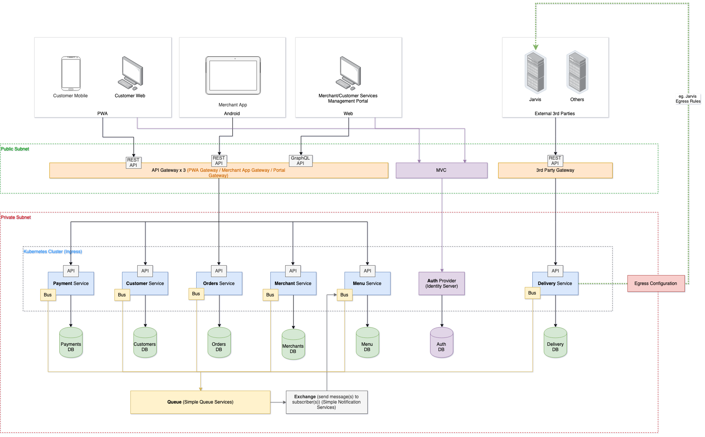
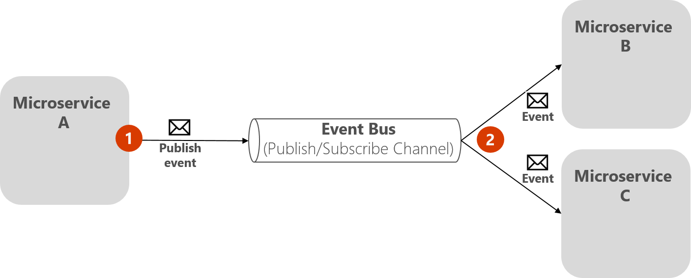

# [< Back](../README.md) | API Architecture

This document serves to provide information on the service code architecture.


OI System Architecture - the API will be internal, eg. **Menu** Service

Some features:

- [Docker](#docker)
- [CQRS (Command Query Responsibility Segregation)](#cqrs)
- [Domain events](#domain-events)
- [Integration events](#integration-events)
- [Event bus](#event-bus)
- Integration tests
- Load tests
- Data migrations

[Useful links](#more-information)

---

## Requirements

Please ensure you have the following installed on your local machine:

- Docker (for Windows or Mac, etc)
- Dotnet core 3.x SDK & runtime
- Redis client (to view what's happening in your distributed cache)
- PostgreSQL client (to view what's happening in your db server)

---

<h2 id="docker">Docker</h2>

> Docker is a set of platform as a service products that use OS-level virtualization to deliver software in packages called containers. Containers are isolated from one another and bundle their own software, libraries and configuration files; they can communicate with each other through well-defined channels. - [Wikipedia](https://en.wikipedia.org/wiki/Docker_(software))

The template uses `Docker` in order to create and setup the necessary network and infrastructure, and the actual API service.

**eg. for infrastructure and network (from root directory in terminal/command prompt):**

```shell
docker-compose -f "setup/docker-compose.yml" up -d --build
```

**eg. for API service (from root directory in terminal/command prompt):**

```shell
docker-compose -f "docker-compose.yml" up -d --build
```

---

<h2 id="cqrs">CQRS</h2>

> CQRS stands for Command Query Responsibility Segregation. It's a pattern that I first heard described by Greg Young. At its heart is the notion that you can use a different model to update information than the model you use to read information. - [Martin Fowler](https://martinfowler.com/bliki/CQRS.html)

The CQRS pattern is used apposed to the more traditional REST API.

Another excerpt from the Martin Fowler link above:

CQRS naturally fits with some other architectural patterns.

- As we move away from a single representation that we interact with via CRUD, we can easily move to a task-based UI.
- CQRS fits well with **event-based programming models**. It's common to see CQRS system split into separate services communicating with Event Collaboration. This allows these services to easily take advantage of Event Sourcing.
- Having separate models raises questions about how hard to keep those models consistent, which raises the likelihood of using eventual consistency.
- For many domains, much of the logic is needed when you're updating, so it may make sense to use EagerReadDerivation to simplify your query-side models.
- If the write model generates events for all updates, you can structure read models as EventPosters, allowing them to be MemoryImages and thus avoiding a lot of database interactions.
- CQRS is suited to complex domains, the kind that also benefit from **Domain-Driven Design**.

*For an example of the 'Command' and it's 'CommandHandler' implementation, browse to:*

`/src/Api/Application/Commands`

*For an example of the 'Query' implementation, browse to:*

`/src/Api/Application/Queries`

> ***NOTE:***
> The current architecture makes use of the MediatR library. MediatR is essentially a library that allows in process messaging – which in turn allows you to follow the Mediator Pattern!
>
> MediatR is used for handling *'commands'* and *'domain events'*.

---

<h2 id="domain-events">Domain events</h2>

> A domain event is, something that happened in the domain that you want other parts of the same domain (in-process) to be aware of. The notified parts usually react somehow to the events. An important benefit of domain events is that side effects can be expressed explicitly. - [Microsoft](https://docs.microsoft.com/en-us/dotnet/architecture/microservices/microservice-ddd-cqrs-patterns/domain-events-design-implementation)

We've implemented the domain event as a way of allowing other aggregates of the service, within the service's bounded context, to be able to react and have additional behavior.

eg. When a 'demo' entity is created, it will raise a `DemoCreatedDomainEvent` and inside the domain event handler `DemoCreatedDomainEventHandler`, we can alter other aggregate states, or create new aggregates.

The benefit of the domain event, is that the event chain is handled in a singular transaction scope.

```csharp
public class DemoCreatedDomainEvent : INotification
{
    public Demo Demo { get; }

    public DemoCreatedDomainEvent(Demo demo) => Demo = demo;
}
```

> ***NOTE:***
> MediatR is used for handling *'commands'* and *'domain events'*.

---

<h2 id="integration-events">Integration events</h2>

> Integration Events are events which are sent to other systems, bounded contexts or micro-services. Integration events are typically sent over some kind of an event bus asynchronously. Consider a scenario of an e-commerce order fulfillment system. - [Microsoft](https://docs.microsoft.com/en-us/dotnet/architecture/microservices/microservice-ddd-cqrs-patterns/domain-events-design-implementation)

The overall architecture is an event-driven design. So the only way internal services are allowed to communicate with each other is by raising an event.

The incorporated API message bus will raise an event by pushing a message into a message queue. A message queue will then have an exchange bound to it, that will act as subscriptions to the message (event).

When an internal service subscribes to a message (event), the subscription will be configured in its own message bus.

*An integration event is basically a data-holding class, as in the following example:*

```csharp
namespace Shared.Events.V1
{
    /// <summary>
    ///     A demonstration event contract.
    /// </summary>
    public interface DemoFiredEvent
    {
        /// <summary>
        ///     A correlation identifier for tracking message.
        /// </summary>
        public Guid CorrelationId { get; set; }
        /// <summary>
        ///     A description for the demonstration object.
        /// </summary>
        public string Description { get; set; }
    }
}
```

*Sending an integration event:*

```csharp
await _publishEndpoint.Publish<Events.DemoFiredEvent>(new
{
    CorrelationId = request.CorrelationId,
    Description = "This is just a demonstration..."
});
```

> ***NOTE:***
> The message bus is configured using MassTransit.

---

<h2 id="event-bus">Event bus</h2>

> An event bus allows publish/subscribe-style communication between microservices without requiring the components to explicitly be aware of each other. - [Microsoft](https://docs.microsoft.com/en-us/dotnet/architecture/microservices/multi-container-microservice-net-applications/integration-event-based-microservice-communications)


**Figure 6-19.** Publish/subscribe basics with an event bus

For local development purposes, the current code template uses RabbitMQ as the event bus inbetween services.

In the cloud environments (AWS), the implementation uses Amazon's SQS and SNS.

---

<h2 id="integration-tests">Integration tests</h2>

> Integration testing is the phase in software testing in which individual software modules are combined and tested as a group. Integration testing is conducted to evaluate the compliance of a system or component with specified functional requirements. It occurs after unit testing and before validation testing. - [Wikipedia](https://en.wikipedia.org/wiki/Integration_testing)

Integration tests uses xunit as the test library to assert on test requirements.

-*TODO: Add more details*

---

<h2 id="load-tests">Load tests</h2>

> Load testing is the process of putting demand on a system and measuring its response. - [Wikipedia](https://en.wikipedia.org/wiki/Load_testing)

Load tests are currently using Artillery. Tests do require more work.

```yaml
config:
  target: 'http://localhost:5800/v1'
  phases:
    - duration: 60
      arrivalRate: 20
  defaults:
    headers:
      # x-my-service-auth: '987401838271002188298567'
scenarios:
  - flow:
    - get:
        url: "/demos/1"
```

-*TODO: Add more details*

---

<h2 id="data-migration">Data migration</h2>

---

<h2 id="more-information">For more information:</h2>

- [MediatR](https://github.com/jbogard/MediatR) - Simple, unambitious mediator implementation in .NET
- [MassTransit](https://masstransit-project.com/) - A free, open-source distributed application framework for .NET
- [RabbitMQ](https://www.rabbitmq.com/) - RabbitMQ is the most widely deployed open source message broker
- [Amazon Simple Queue Service (SQS)](https://aws.amazon.com/sqs/) - Amazon Simple Queue Service (SQS) is a fully managed message queuing service that enables you to decouple and scale microservices, distributed systems, and serverless applications.
- [Amazon Simple Notification Service (SNS)](https://aws.amazon.com/sns/?whats-new-cards.sort-by=item.additionalFields.postDateTime&whats-new-cards.sort-order=desc) - Amazon Simple Notification Service (SNS) is a highly available, durable, secure, fully managed pub/sub messaging service that enables you to decouple microservices, distributed systems, and serverless applications.
- [Artillery](https://artillery.io/) - Artillery is a modern, powerful & easy-to-use load testing and functional testing toolkit. Use it to ship scalable backends, APIs & services that stay performant & resilient under high load.
