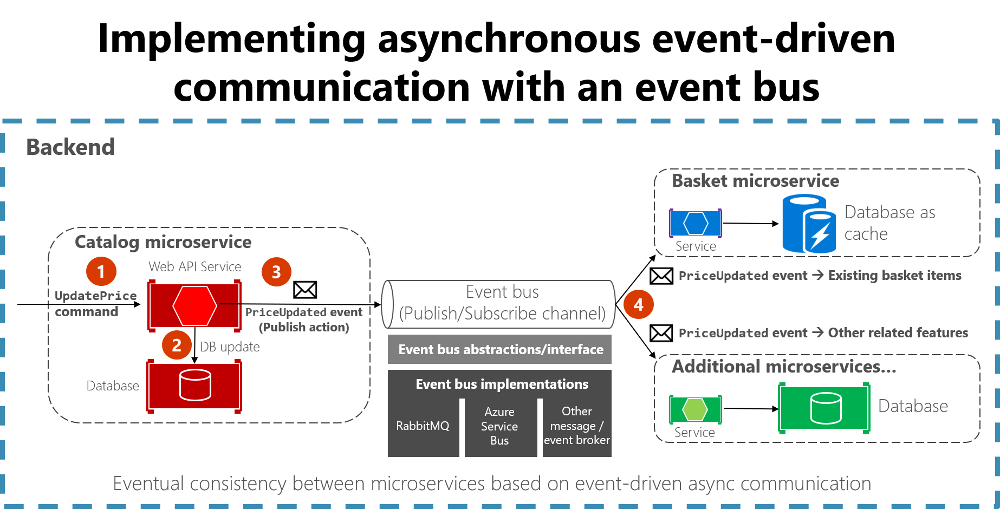

# [< Back](../README.md) | API Events

The API template uses MassTransit to assist with the event-base communication between microservices. Also known as integration events.

For more information regarding this, please visit [Microsoft's implementing event-based communication](https://docs.microsoft.com/en-us/dotnet/architecture/microservices/multi-container-microservice-net-applications/integration-event-based-microservice-communications).

---

## [Terminologies](#terminologies)

* ***Integration events*** - Integration events are used for bringing domain state in sync across multiple microservices or external systems. This is done by publishing integration events outside the microservice. When an event is published to multiple receiver microservices (to as many microservices as are subscribed to the integration event), the appropriate event handler in each receiver microservice handles the event.

* ***Domain events*** - A domain event is, something that happened in the domain that you want other parts of the same domain (in-process) to be aware of. The notified parts usually react somehow to the events.

* ***The event bus*** - An event bus allows publish/subscribe-style communication between microservices without requiring the components to explicitly be aware of each other, as shown in Figure 6-19.

---

## [Stores Event Implementation](#event-implementation)

### **Development (local docker)**

For local development purposes, we are using a combination of MassTransit and RabbitMQ.

### **AWS environments (Vegas, Staging and Production)**

For AWS purposes, we are using a combination of MassTransit and Amazon SQS (plus SNS for pub/sub).

### **1. Creating Events**

Events are simple c# `interface contracts`. eg:

```csharp
namespace Shared.Events.V1
{
    public interface OrderCreated
    {
        Guid CorrelationId { get; set; }
        long OrderId { get; set; }
        ...
    }
}
```

***Gotcha:*** All events has to use the same namespace as displayed above.

### **2. Publishing and Subscribing Events**

As mentioned already, the template makes use of _**MassTransit**_. So publishing is done easily using MassTransit's `_publishEndpoint` which is injected into the constructor of the object wanting to publish any events.

***How to publish an event:***

```csharp
public async Task<IActionResult> PostAsync([FromBody]CreateDemoRequest createDemoRequest)
{
    var demoId = await _demoService.CreateNewDemoAsync(createDemoRequest.Name);

    await _publishEndpoint.Publish<Events.DemoFiredEvent>(new
    {
        CorrelationId = createDemoRequest.CorrelationId,
        Description = "This is a test demostration event"
    });

    return CreatedAtRoute("CreateDemo", new DemoResponse { Id = demoId, Name = createDemoRequest.Name });
}
```

Note: The correlationId uses the id from the incoming HTTP request.

### **3. How to subscribe to an event:**

The setup/configuration is done in the `MassTransitExtensions.cs` file. Inside the `Bus.Factory` setup, you need to setup a ReceiveEndpoint.

```csharp
configurator.ReceiveEndpoint($"{Environment.MachineName.ToLower()}-demo-queue", queueConfigurator =>
{
    queueConfigurator.AutoDelete = true;
    queueConfigurator.Consumer<DemoFiredEventConsumer>(serviceProvider);
});
```

---

## [Diagram figures](#diagrams)


**Figure 6-18.** Event-driven communication based on an event bus


**Figure 6-19.** Publish/subscribe basics with an event bus
