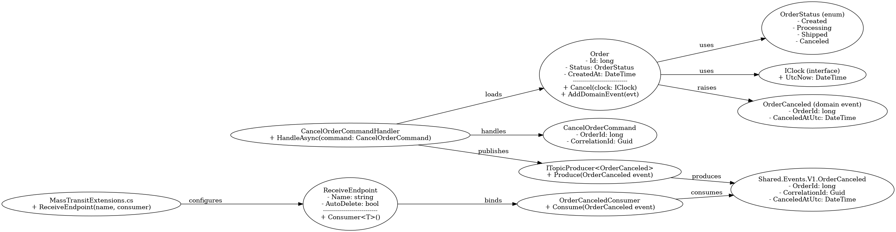

# Order Cancellation Feature – Solution Design & Task Breakdown

## User Story

> As a customer, I want to be able to cancel an order within 15 minutes of placing it, so that I can avoid unwanted charges.


## Acceptance Criteria Recap

- A customer can cancel an order **within 15 minutes** of order creation.
- After 15 minutes, the order **can no longer be canceled**.
- If the order is in **processing** or **shipped** state, it **cannot be canceled**.
- On successful cancellation, the system must emit an `OrderCanceled` **event**.

## Solution Design

### Architecture Overview

This solution follows **Clean Architecture** principles with **Domain-Driven Design (DDD)** and **CQRS**. The design ensures proper **separation of concerns**, **UTC-consistent time logic**, and correct **event publishing** using MassTransit.

### Domain Layer

**Aggregate: `Order`**

- `Status`: An enum or value object (`Created`, `Processing`, `Shipped`, etc.)
- `CreatedAt`: Stored in **UTC**
- `Cancel(IClock clock)` method:
  - Validates time window (`<15 minutes`)
  - Validates status (must be in cancelable state)
  - Transitions to `Canceled`
  - Raises domain event: `OrderCanceled`

```csharp
public void Cancel(IClock clock)
{
    if (Status != OrderStatus.Created)
        throw new InvalidOperationException("Cannot cancel a processed order.");

    if (clock.UtcNow - CreatedAt > TimeSpan.FromMinutes(15))
        throw new InvalidOperationException("Cancellation window expired.");

    Status = OrderStatus.Canceled;
    AddDomainEvent(new OrderCanceled(Id));
}
```
## Event-Driven Order Cancellation Class Diagram



# Event-Driven Cancellation Flow: OrderCanceled

---
## Order Cancellation Event Flow

```text
Customer
   ↓
API Endpoint (POST /orders/{id}/cancel)
   ↓
CancelOrderCommandHandler
   ↓
Order Aggregate
   - Validates 15-minute window (using IClock)
   - Checks current status (e.g., not Processing/Shipped)
   - Applies domain transition
   ↓
Domain Event: OrderCanceled (internal)
   ↓
OrderCanceledEvent (Shared.Events.V1)
   - Mapped from domain event
   - Includes CorrelationId, OrderId, CanceledAtUtc
   ↓
Kafka Producer via ITopicProducer<OrderCanceledEvent>
   - Published using MassTransit
   - Respects configured topic conventions
   ↓
External Consumers (Other Microservices)
   - Subscribed via MassTransit ReceiveEndpoint
   - Examples: PaymentService, NotificationService, AdjustInventory

